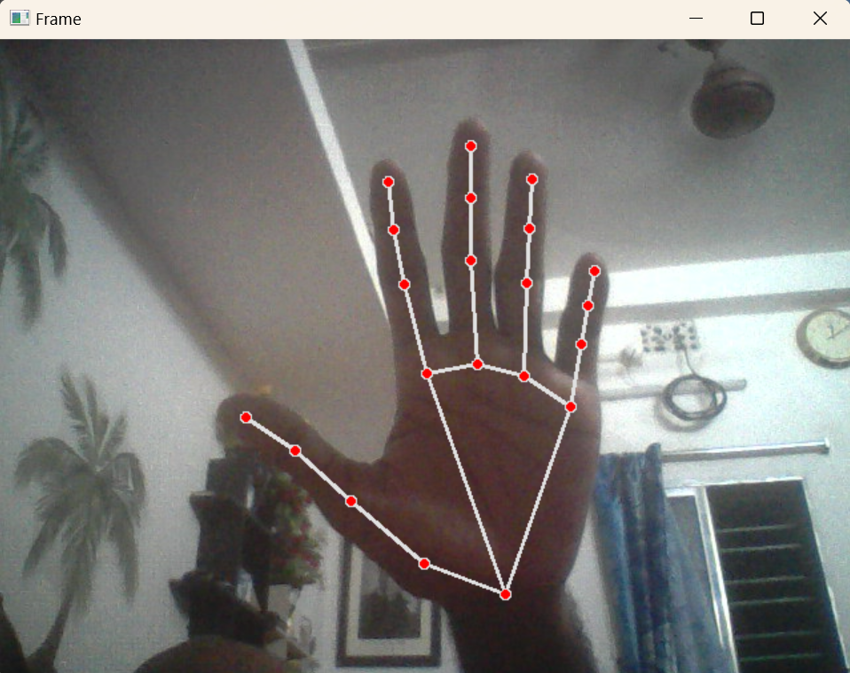

[](https://www.python.org/downloads/release/python-3107/) 
[](https://pypi.org/project/opencv-python/)
[](https://pypi.org/project/mtcnn/)
[](https://pypi.org/project/mediapipe/)
[](https://pypi.org/project/pyautogui/)

---


[](https://github.com/baponkar/computer-vision/stargazers)
[](https://github.com/baponkar/computer-vision/blob/main/LICENSE)


 [English](README.md) | [বাংলা](README.ben.md)
---

<!---->


# [Computer Vision](https://github.com/baponkar/computer-vision)

## A Screenshot

<!---->

 

<video width="600" controls autoplay loop>
  <source src="screenshots/finger_count.mp4" type="video/mp4">
  Your browser does not support the video tag.
</video>

## License
[GNU GPL v3.0](LICENSE)

## Description :
This repository have programs which can detect eye, eye blink, face, hand, palm, mouth, face, smile by using  opencv haarcascade xml files and mncnn and mediapipe. Haarcascade detection were not too sensitive but detection by mediapipe and mtcnn models awesome.

## Future addition:

* Full body detection
* Motion Sensor
* Cursor movement and click by eye
* Cursor movement and click by finger
* Emotion detection
* Sleep detection.
* Build a Security system


## Python Version - 3.7.10


## Creating and Activate Virtual Python Envirionment

[](#)

```
cd project_directory
pip install venv
python -m venv venv
./venv/Scripts/activate
```

[](#)

```bash
cd project_directory
pip install venv
python -m venv venv
source venv/bin/activate
```

[](#)

```
cd project_directory
pip install venv
python -m venv venv
source venv/bin/activate
```

## To download required python packages :
Now you are ready to install required python packages in your virtual envirionment.
```
pip install -r requirements.txt
```

## Installing Manually :

```
pip install opencv-python pyautogui
pip install mtcnn
pip install mediapipe
```

## Latest Stable Release :

* [v2.0](https://github.com/baponkar/computer-vision/releases/tag/2.0)

* [v1.0](https://github.com/baponkar/computer-vision/releases/tag/1.0)

## Haarcascade files are downloaded from  [here](https://github.com/anaustinbeing/haar-cascade-files) .

## Credits:

1. [haar-cascade-files](https://github.com/anaustinbeing/haar-cascade-files)


## Contact:

[](https://x.com/kar_bapon)
[](https://in.linkedin.com/in/bapon-kar-815098200)
[](https://youtube.com/@gamingjam8394?si=cElodqeKqe5PgX_o)

----
Copyright © [baponkar](https://github.com/baponkar) 2024